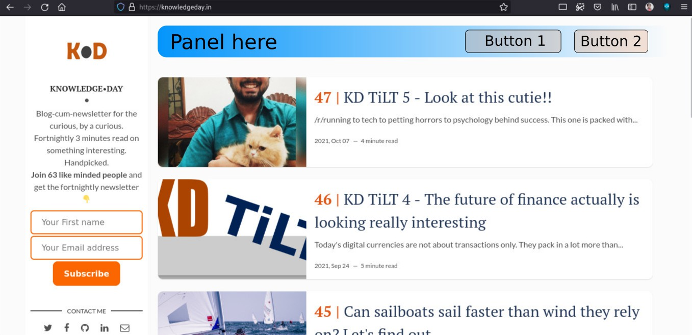

# CONTRIBUTING.md
Single page information for all about the items that could have contributors' support.  
For any questions related to anything here, please feel free to contact me [@OhY4sh](https://twitter.com/ohy4sh) on Twitter or through [email](mailto:ohyash@hotmail.com).  

## Project info
Re-iterating what README.md already covers.  
This is [jekyll](https://jekyllrb.com/) based blog website. So all the core Jekyll based syntax applies: 
- All the configs in [_config.yml](_config.yml), 
- Liquid templating language for all of the tiny programming is there, 
- posts as created in markdown in [_posts](/_posts/) directory, 
- CSS(custom) in [assets](/assets) directory.  
- Jekyll (which is written in Ruby), builds it into a static site in `_site` directory. The gh-pages then deploys the website automatically (provided the build completes successfully :-p).  

The result is what you see at [knowledgeday.in](https://knowledgeday.in)  
  
  
This is stable and basic feature complete, but being an actively run project this has scope for some important updates, and some may be less important. This document contains the items that need work. If you like any of these and are interested in contributing, please feel free to [contact me](mailto:ohyash@hotmail.com).   

## Picking up an item

1. Notify me before starting work so I can update the status of the item. (Alternatively, make a pull request updating the work status as `In Progress`)  
2. Fork the repository, and make changes in your repo. You just need Jekyll running on your local machine to see your changes on the fly. No additional setup is needed.  
3. No code guidelines as such. Just take a look at the existing code and try to follow the same in your code. If you see some error or bad indentation in the existing code, you can modify that as well.  

## Issues/Features

### Sign up page
_(Difficulty: **Easy**, Status: **Not picked**)_  
This is a blog letter, the sign-ups for the `letters` are handled through the form in the side bar (or on top in mobile view). Functionality-wise, it works fine, but it's still preferred to have a separate page for signup. With same form inputs. (So this eventually can be shared as a direct sign-up link on various social media platforms.)  

P.S the sidebar should be present on the sign-up page too, we'll remove the sign-up form from the sidebar once a custom signup page is in place. Imagine this as a normal blog post, but instead of blog content, we have a signup form only. (use [this](https://perspectiveix.substack.com/) as a design sample)  

### Top bar above articles on home page
_(Difficulty: **Easy**, Status: **Not picked**)_  
The website could offer a few more functionalities within the current design. Like search, [browse by tags](https://knowledgeday.in/tags/), and a signup page.  
The idea is to simply have a panel on the [homepage]() right above the articles. That could hold the buttons or some objects as needed.   
The objects are not important for this item. Just the panel on the top. (HTML, CSS only)  

Here's a rough mockup for what I'm trying to picture up for you here:
  

### Search functionality
_(Difficulty: **Easy/Medium**, Status: **Not picked**)_  
Search functionality for the website. There are libraries to do that [[1](https://github.com/christian-fei/Simple-Jekyll-Search)],[[2](https://www.alaycock.co.uk/2016/02/setting-up-lunr-js-in-jekyll)], more?  

This is not yet tested and implementation is away. Would love it if you can share hands for this. Another thing that can be explored with this is using "[search with google](https://talk.jekyllrb.com/t/how-to-add-a-search-bar/606/3)" in Jekyll blogs if native searches are not good enough.  

### Something else?
You visited the website, you see something that could be bettered? Maybe you'd prefer a dark mode? Feel free to contact me and discuss.  
